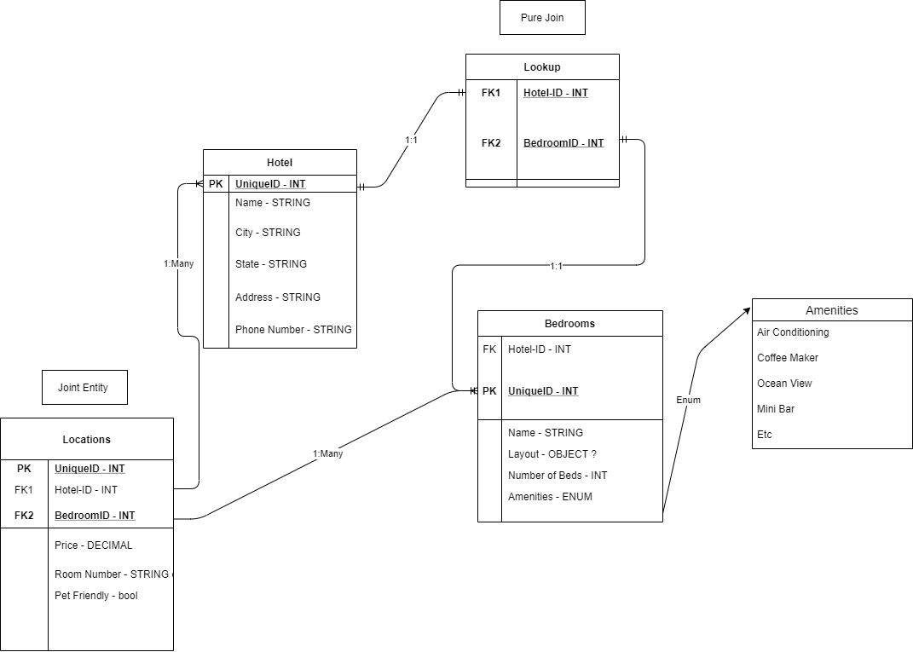

# Async-Inn

## Contributors: Kjell Overholt, Alan Hung & Jordan Kidwell

## 01/25/21

## Visual

## Explanation of Tables:
- **Hotel Table**: contains all of the hotel locations.
- **Locations Table**: contains the prices, room numbers and pet friendly attributes of the rooms
- **Bedrooms Table**: contains the characteristics of a bedroom that includes layout, name and amenities.
- **Amenities Table**: contains the amenities that are in each specific room 
- **Lookup Table**: contains 2 foreign keys that connected two tables together

## Explanation of Relationships:
-  *Hotel Table*:
   - 1:1 relationship w/ lookup table in order to extract information from the bedrooms table. 
   - Many:Many w/ bedroom table seperated by pure join table(lookup table)
   - Many:1 w/ joint entity table(locations table) in order to extract price, room number and pet friendliness.
- *Bedroom Table*:
  - 1:1 relationship w/ pure join(lookup table) in order to get hotel location for each of the bedroom types.
  - Many:1 w/ bedroom table seperated by pure join table(lookup table)
  - Enums for amenities to describe the possible amenity options a room can have 
  - Many:1 w/ joint entity table(locations table) in order to extract price, room number and pet friendliness.
- *Locations Table(joint entity table)* 
  - 1:Many w/ bedroom table in order to get room layout, name, amenities, etc.
  - 1:Many w/ hotel table in order gather information like name, city, address, etc for a hotel.
- *Amenities Table*:
  - Connected by enum to gather information about the amenities provided in each possible room
- *Lookup Table*:
  - 1:1 relationship w/ hotel and bedrooms table to gather information to join both tables. 