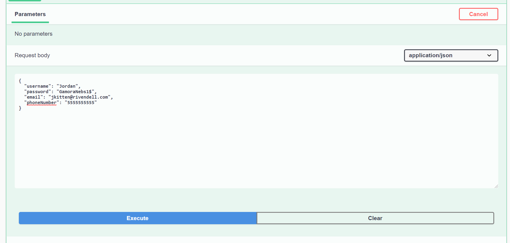
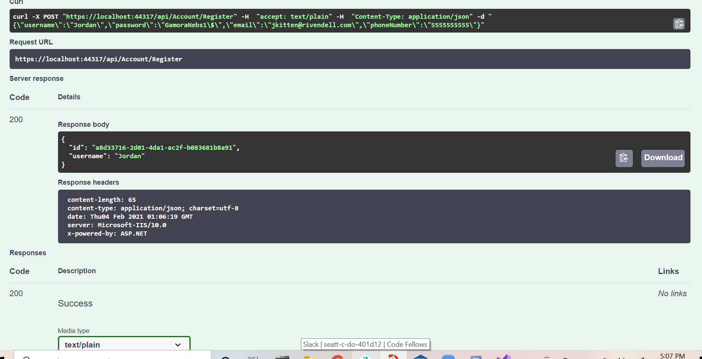
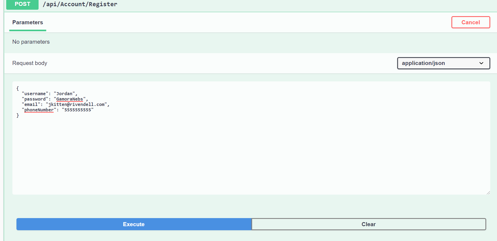
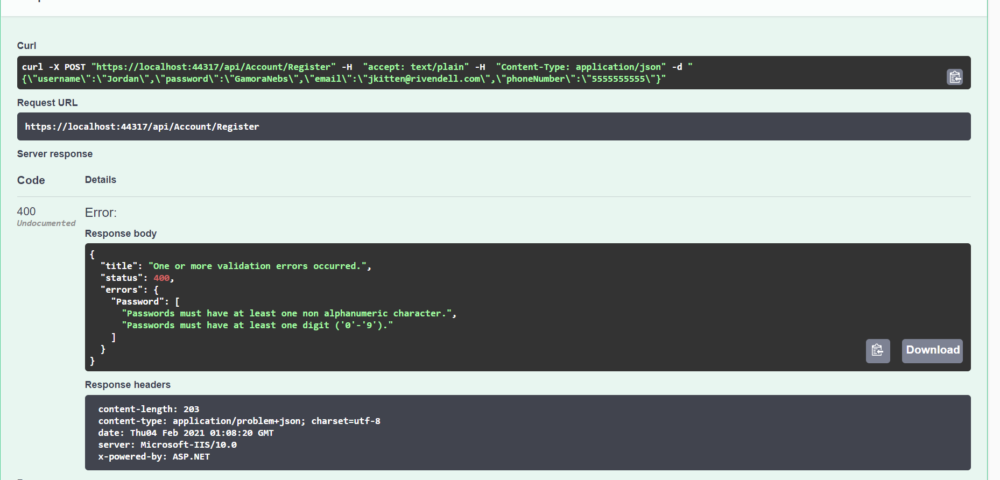
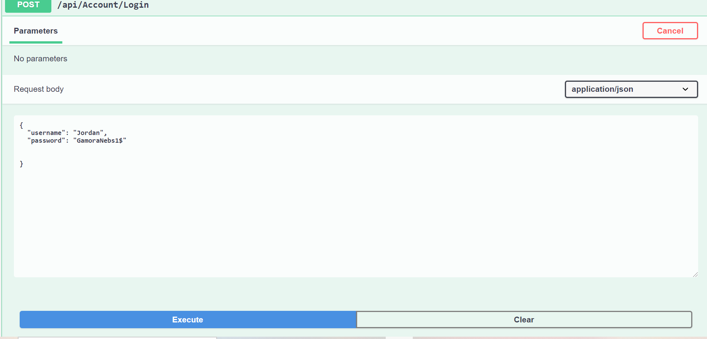
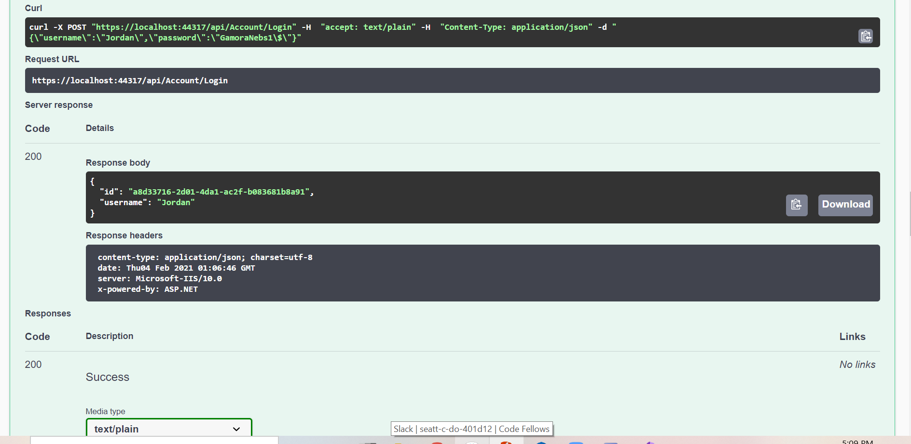
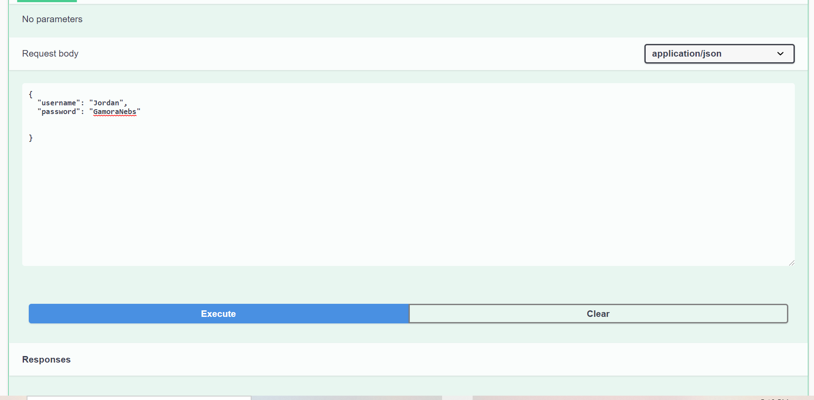
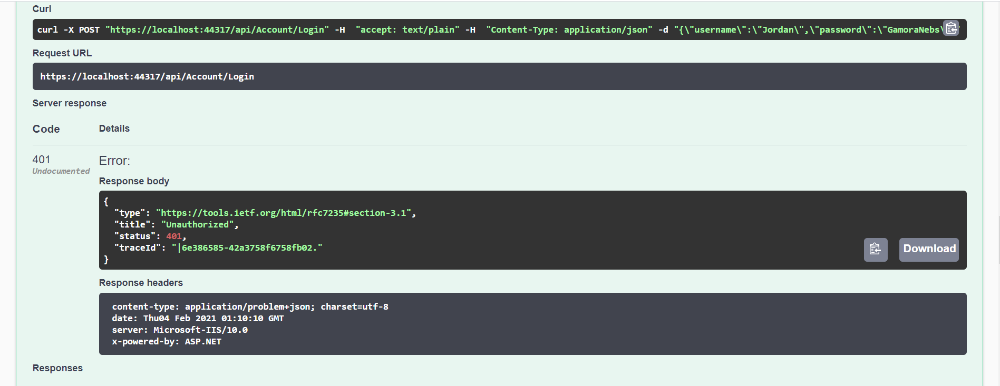

# Async-Inn

## Author: Jordan Kidwell

## Overview:
- This web app simulates database information regarding a hotel chain, in specific the locations, rooms, and room amenities. This highlights some features like creation of SQL databases, creating models, seeding data and migrating the database. Within there are controllers that are set up to be an API for the data. We utilize Data Transfer Objects (DTO) in order to control the flow of data and what kind of data to send out. We added in a user database that stores users using the .NET Identity Framework.

## Visual

## Explanation of Tables & Relationships:
-  *Hotel Table*:
   - This table contains the details for each one that includes name, city, state, address and phone number. 
   -It is identified with a int Primary Key "LocationID"
   - 1:1 relationship w/ LocationRoom table to identify which rooms are at which location.
- *HotelRoom Table*:
  - This table joins together the Composite Key using foreign keys for HotelID and RoomID in order to be able to store which of the rooms are at which location.
  - It contains information about the price and RoomNumber, these are unique to each specified location.
  - 1:1 relationship with Hotels and Rooms to create composite key
- *Room Table* 
  - This table stores the details for each room and also contain a primary key "RoomID", string for RoomName & Enum for the layout (number of rooms).
  - 1:1 relationship w/ both the HotelRooms table and the RoomAmenities table.
- *RoomAmenities Table*:
  - This is our Pure Join table that brings together the "LayoutID" from the Room table & the "LayoutID" from Amenities Table.
  - It only 1:1 w/ rooms and amenities to create a connection between the two. 
- *Amenities Table*:
  - This table has information about the amenities. (ID and Name)
  - 1:Many w/ RoomAmenities table to conjoin together with the rooms table so that multiple amenities can be added.

## Explanation of Identity: 
- Identity at it's core is the users authorization and authorization to ensure that the person indeed is who they say they are. In frameworks, identity is a membership system that adds login functionality to the core applications.
- **The flow within**: 
  - We start by creating our Application User model, which will inherit from IdenityUser (which comes from the dependency, a default implementation for a user)
  - After creating our model, in our DbContext (to reference to our DB), we change our class to inherit from "IdentityDbContext" instead of just DbContext
  - Identity uses its own stuff to add, therefore the base line is important and must be uncommented to allow it to work.
  - Then, migrate our identity data to then create the tables that come from the dependency. Within this, you will see TONS of code and lots of tables we didn't techincally create.
  - After all that fun, create in ConfigureServices the .AddTransient line so that we can create our interface and service that we will need.
  - Creating the API: start by creating our Register() so that users can input their data to be saved to the database, with required fields indicated and proper exception messages to handle password requirements.
  - After creating the api, we then go on to creating a Login so that any registered users saved in the database will be able to login and thrown exceptions if they are not in the system or something was incorrect.
- **Successful Register**:
   
- **Output**:
  
- **Unsuccessful Register**:
 
- **Output**:

- **Successful Login**:

- **Output**:

- **Unsuccessful Login**:

- **Output**:

## Version
- 1.0.0: Initial Release
- 1.0.1: Applied Dependency Injection
- 1.0.2: Applied join tables
- 1.0.3: 
- 1.0.4: Applied DTOs
- 1.0.5: Applied User Account Database